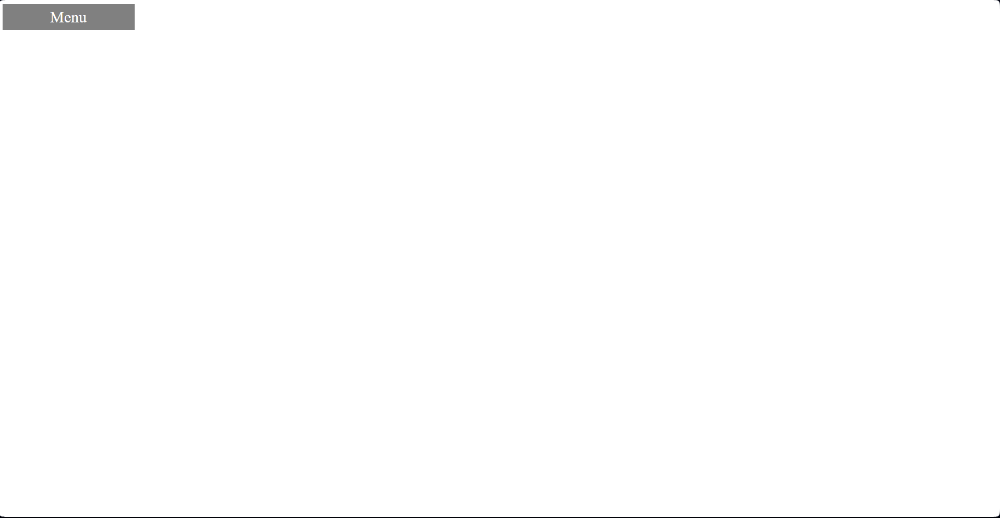
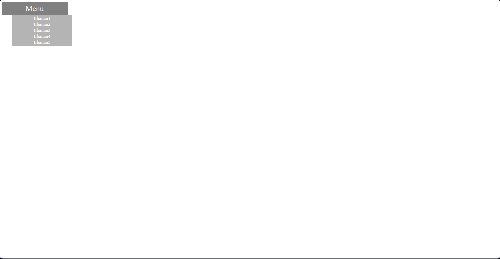

# Click-Drop-Menu Component (Tıklayınca açılan menu bileşeni)

Bu proje, JavaScript kullanarak oluşturulan basit bir click-drop-menu(Tıklayınca açılan menu) componentidir(Bileşen). Kullanıcıların üzerinde tıklaması ile aşağıya doğru bir biçimde açılan bir menu ekranı sunar.

## Özellikler

- Basit tasarım.
- Tıklanınca açılan menü.
- Menu açık durumda iken menu dışarısında bir yere tıklanınca kapanan menu ögesi.
- Kolay özelleştirilebilme.

## Ekran Görüntüsü

## Kurulum

Bu projeyi yerel bilgisayarınızda çalıştırmak için sadece projenin dosyalarını indirin ve `index.html` dosyasını çalıştırın.

## Kullanım

1. Menu butonuna tıklayın.
2. Açılan menuyu kapatmak için tekrar menu butonuna tıklayın veya sayfadaki herhangi bir konuma tıklayın.

## Dosya Yapısı

- `index.html`: HTML dosyası, uygulamanın temel yapısını içerir.
- `style.css`: CSS dosyası, uygulamanın stilini belirler.
- `script.js`: JavaScript dosyası, uygulamanın işlevselliğini sağlar.

## İletişim

Bu component, başlangıç seviyesinde olan bir click-drop-menu bileşenidir.Özelleştirilebilir ve geliştirilebilirdir . Proje hakkında herhangi bir sorunuz varsa, lütfen benimle iletişime geçin:

- E-posta: [erceyasinemre17@gmail.com](mailto:erceyasinemre17@gmail.com)
- Instagram: [ne_bilim17](https://www.instagram.com/ne_bilim17/)